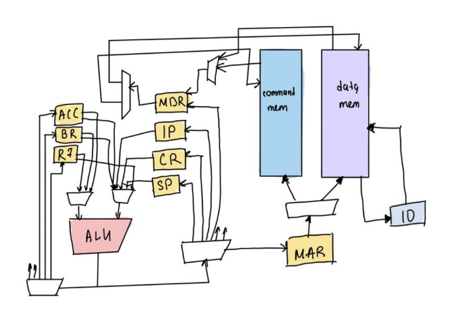

# csa-lab3

- Павлова Полина `P33102`
- `asm | cisc | harv | hw | tick | struct | stream | mem | prob2`

## Язык программирования
### Синтаксис
``` ebnf
<label> ::= <identifier>：
<identifier> ::= <letter>|<identifier> <letter>
<comment> ::= ; <identifier>
<letter> ::= A|B|C|D|E|F|G|H|I|J|K|L|M|N|O|P|Q|R|S|T|U|V|W|X|Y|Z 
<statement> ::= <label> <instruction>|<instruction>
<instruction> ::= <opcode> <operand>|<opcode> <operand> <operand>
<opcode> ::= 'mov'|'push'|'pop'|'call'|'ret'|'add'|'mul'|'div'|'jmp'|'cmp'|'jl'|‘halt’
<operand> ::= <identifier>|<number>|<register>
<number> ::= <addrhex>|<memhex>
<addrhex> ::= <hexadecimal number up to ADDR_MAX>
<memhex> ::= <hexadecimal number up to MEM_MAX>
<register> ::= 'ac'|'cr'|'dr'|'br'
```
### Семантика
| mnemonic             |                                                 purpose                                                 |    example |
|:---------------------|:-------------------------------------------------------------------------------------------------------:|-----------:|
| mov dest src         | move data between registers, load immediate data into registers, move data between registers and memory |   mov ac 4 |
| push src             |           insert a value onto the stack.  Useful for passing arguments, saving registers, etc           |     push 4 |
| pop  dest            |                                     remove topmost value from stack                                     |     pop bp |
| call func            |                    push the address of the next instruction and start executing func                    | call print |
| ret                  |                    pop the return program counter, and jump there. Ends a subroutine                    |        ret |
| add dest, src        |                                            dest = dest + src                                            | add ac, dr |
| mul   src            |                      multiplay acc and src as unsigned integers, put result on acc                      |     mul dr |
| div  dest, src       |                                    dest = dest/src remainder -- MDR                                     | div acc br |
| jmp   label          |                       goto the instruction label: . skip anything else in the way                       |   jmp loop |
| sub   dest, src      |                                             dest = dest-src                                             |  sub ac, 4 |
| jn    label          |                                        goto label if NF == TRUE                                         |    jn loop |
| halt                 |                                              stop running                                               |       halt |
| jz    label          |                                        goto label if ZF == TRUE                                         |    jz loop |
| ld    dest_reg, addr |                                         dest_reg <-- mem(addr)                                          |    jz loop |
| sv    reg, addr      |                                            reg --> mem(addr)                                            |    jz loop |
| test    reg          |                                                set flags                                                |    jz loop |


- Область видимости в ассемблере единая; типизации как таковой не существует 

## Организация памяти
- Работа с переменными/константами:
  - команды, работающие с переменными: см. mov, ld, push, pop etc
- Модель памяти
  - Гарвардская архитектура --> память неоднородная
  - Память команд. Машинное слово нефиксированно (cisc).
  - Память данных. Машинное слово 32 бита, знаковое/беззнаковое
  - Адрес памяти 12 бит
  - Регистры общего назначения:
    - ac -- accumulator register: values are returned from functions in this register
    - cr -- scratch register, counter
    - dr -- scratch register, for data read from mem
    - br -- preserved register
    - r7 -- additional gpr
## Система команд
Мнемоника ассемблера и машинных слов совпадают (согласно варианту машинное слово имеет небинарное (struct)).
- 32-битная память данных
- регистры 32 бита
- 7-битный адрес

Команды как таковые не кодируются, т.к. по варианту машинное слово инструкции имеет тип struct

### Кодирование инструкций
- Машинный код сериализуется в список JSON
- Адрес команды -- индекс списка

Пример кодирования инструкций:

```json
[
    {
        "opcode": "db",
        "address": 0,
        "data": "7"
    },
    {
        "opcode": "db",
        "address": 1,
        "data": "0"
    },
    {
        "opcode": "db",
        "address": 2,
        "data": "3"
    },
    {
        "opcode": "mov",
        "address": 0,
        "dest": {
            "type": "reg",
            "value": "acc"
        },
        "source": {
            "type": "const",
            "value": "1"
        }
    },
    {
        "opcode": "ld",
        "address": 1,
        "dest": {
            "type": "reg",
            "value": "r7"
        },
        "source": {
            "type": "const",
            "value": "0"
        }
    },
    {
        "opcode": "mov",
        "address": 2,
        "dest": {
            "type": "reg",
            "value": "br"
        },
        "source": {
            "type": "const",
            "value": "5"
        }
    },
    {
        "opcode": "sv",
        "address": 3,
        "dest": {
            "type": "reg",
            "value": "br"
        },
        "source": {
            "type": "const",
            "value": "3"
        }
    },
    {
        "opcode": "jmp",
        "address": 4,
        "op": 5
    },
    {
        "opcode": "mov",
        "address": 5,
        "dest": {
            "type": "reg",
            "value": "acc"
        },
        "source": {
            "type": "const",
            "value": "4"
        }
    },
    {
        "opcode": "mod",
        "address": 6,
        "op": {
            "type": "const",
            "value": "2"
        }
    },
    {
        "opcode": "mov",
        "address": 7,
        "dest": {
            "type": "reg",
            "value": "acc"
        },
        "source": {
            "type": "const",
            "value": "4"
        }
    },
    {
        "opcode": "div",
        "address": 8,
        "op": {
            "type": "const",
            "value": "2"
        }
    },
    {
        "opcode": "mul",
        "address": 9,
        "op": {
            "type": "const",
            "value": "2"
        }
    },
    {
        "opcode": "halt",
        "address": 10
    }
]
```

## Транслятор
- принимает на вход машинные инструкции, переводит их в машинный код типа struct, элементы структуры задаются динамически в зависимости от инструкции

Сама по себе трансляция происходит в один проход, адресация задается для псевдоинструкции db отлично от адресации инструкций. Как такового разделения на секции нет,
но у инструкций и данных разное адресное пространство, т.к. по варианту гарвардская архитектура
## Модель процессора

### DataPath
- содержит логику работы с ALU
- поддерживает memory-mapped IO
- содержит регистры: ACC, MDR, MAR, SP, CR, BR, R7

### ControlUnit
- считает такты
- "управление" выполнением инструкций через взаимодействие с модулем DataPath, который управляет памятью
- поддерживает шаги выполнения инструкций, в зависимости от инструкции каждый шаг выполняется за разное число тактов
- Шаги:
  - Цикл выборки инструкции
  - Цикл выборки операнда
  - Цикл выборки адреса 
  - Выполнение инструкции